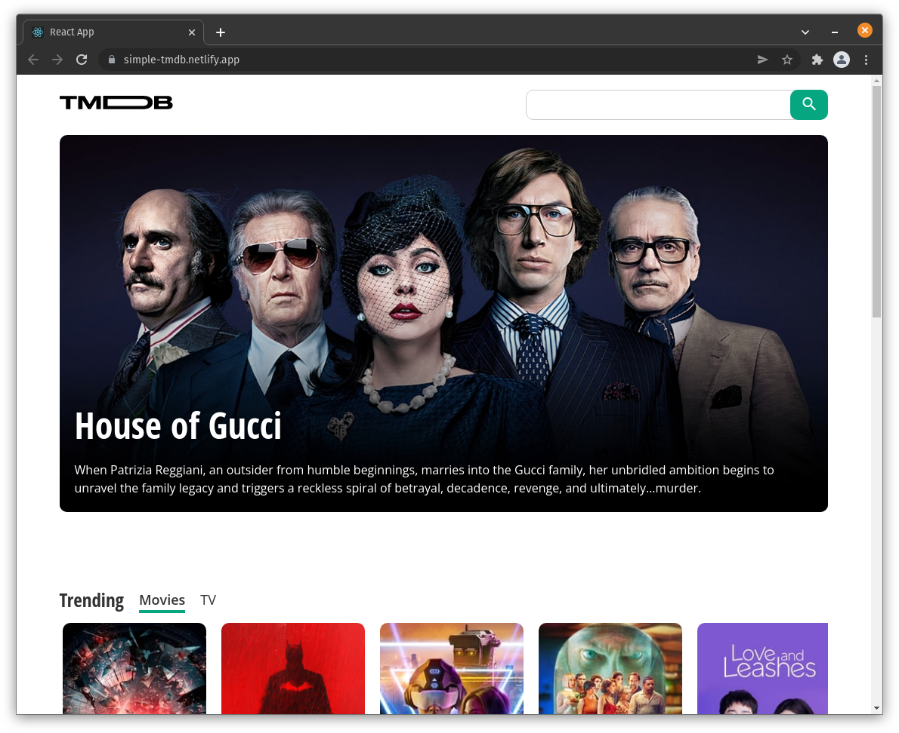

# React.js TMDB Clone

## See it online: 🌎 [simple-tmdb.netlify.app](https://simple-tmdb.netlify.app/)

Considering this my second try at building frontend UI with React.js I wanted to build a more structured app (folder-wise).

I loosely followed this video:
https://www.youtube.com/watch?v=nTeuhbP7wdE&t=23725s